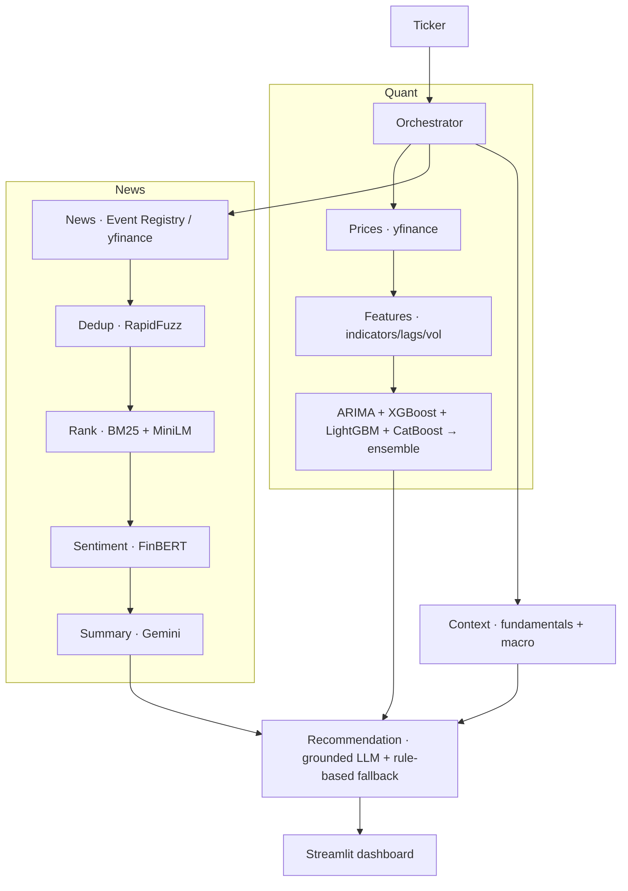

# StockSense AI — Stock Price Prediction using Sentiment Analysis, Agentic AI & Machine Learning


StockSense AI is a **stock-analysis agent**. Given a ticker it forecasts the next move with real ML
models, reads and scores recent news, and fuses both into a **grounded Buy / Hold / Sell** call with a
plain-English *"why buy / why not"* thesis, confidence, risks, and cited sources — in a Streamlit dashboard.

> ⚠️ **Not financial advice.** This is an educational decision-support tool. Markets are risky.

---

## Problem statement

Investors face information overload and fast-moving markets. Traditional analysis is either purely
numerical (ignoring news/sentiment) or a black box (no explanation). StockSense combines **quantitative
forecasting** + **news sentiment** + **agentic LLM reasoning**, and — crucially — reports its forecast
**honestly** against a naive baseline instead of inflating accuracy.

## What makes it honest (and different)

- Models predict **next-day returns**, not price levels, and are always graded against a naive
  *"tomorrow = today"* baseline plus **directional accuracy**. If a model can't beat the baseline, the UI
  says so. (For most large-cap stocks, daily direction is ~coin-flip — StockSense tells you that instead
  of showing a fake 0.94 R².)
- Every recommendation factor is **grounded** in a computed number or a cited article; a post-check
  strips any fabricated URL. The LLM never invents evidence.
- The app **always** produces a recommendation — if Gemini is unavailable (no key / quota), it falls
  back to a deterministic rule-based reasoner.

---

## What's new in v2

- **US ⇄ India markets** — a region switcher and an **Explore** landing that browses index
  categories (S&P 500 / Nasdaq 100 / Dow 30 · Nifty 50 / Nifty 500 / Sensex / Nifty Bank). NSE tickers
  auto-get the `.NS` suffix.
- **Risk & History** page — annualized volatility, max drawdown, beta, historical VaR, 52-week position,
  and the biggest past single-day moves (your "how it got affected in the past").
- **Screener** — rank a whole index by a fast momentum + trend + low-volatility composite (no LLM),
  then click through to a full analysis. Reports coverage; never silently truncates.
- **Compare** — 2–3 stocks side-by-side (forecast, sentiment, risk) with a rebased price overlay.
- **Report export + Watchlist** — download a Markdown/HTML analyst report; save tickers to a watchlist.
- **Ask (conversational analyst)** — a **LangChain** tool-calling agent that answers free-form questions
  ("How risky is Tesla?", "Compare AAPL and MSFT", "Top Nifty 50 names") by calling the real analysis
  tools, grounded in actual data, with a deterministic **fallback** if the LLM is unavailable.

## What's new in v3

Same idea, made faster and turned into a product.

- **A repeat analysis takes ~2 seconds instead of ~81**, and costs **zero API requests**. Profiling
  showed the LLM — not model training — was 85–95% of the wait, so the forecast, the news summary
  and the recommendation are all cached, keyed on the inputs that produced them.
- **One Gemini call per analysis instead of two.** The summary and the recommendation now come from
  a single prompt. That halves usage against the free tier's 20 requests/day/model, and fixed a real
  inconsistency: the old summary never saw the sentiment score, so it could call the news "Mixed"
  while FinBERT said −0.39. It now agrees with the number.
- **Quota-aware LLM fallback.** A per-minute rate limit is retried; a per-*day* quota parks that
  model and skips it, instead of burning ~5s of doomed retries on every later call.
- **Search by company name** — type "apple" or "tata" instead of knowing the ticker. Covers every
  listed company via Yahoo symbol search, ranking your selected market first.
- **Track Record** — grades the app's own past predictions against what prices actually did.
  Pending and unverifiable runs are reported separately, never counted as hits or misses.
- **Watchlist page** — saved stocks as cards with their latest verdict, not just sidebar buttons.
- **Grouped navigation**, real branding, no emoji, and errors in plain English
  ("We couldn't load recent news…") with the technical detail behind a *Technical details* expander.
- **PDF export**, alongside Markdown and HTML.
- **Fixed a hard crash.** The app segfaulted mid-analysis on macOS — GBM training and PyTorch each
  forking OpenMP worker pools across threads, with three copies of `libomp.dylib` in one process.
  See *Troubleshooting*.

Pages: **Dashboard · Forecast · Technical** (Analysis) · **News · Sentiment** (News) ·
**Recommendation · Risk** (Decision) · **Screener · Compare · Watchlist** (Discover) ·
**Ask · Track Record · History** (More).

## Architecture



See **`architecture.md`** for full detail and **`docs/agent_workflow.md`** for the step-by-step agent flow.

## Agent workflow

`Ticker → prices → features → forecast (4 models + ensemble) ∥ news → dedup → rank → FinBERT →
summary ∥ context → fusion → grounded Buy/Hold/Sell → dashboard`. The quant and news pipelines run
concurrently; each stage degrades gracefully (a failure becomes a warning, not a crash).

## Tech stack

| Layer | Choice |
|---|---|
| Prices | `yfinance` (+ disk cache, retries) |
| News | Event Registry API (`requests`) + yfinance `.news` fallback |
| Indicators | `ta` |
| Forecast | `statsmodels` (ARIMA) · `xgboost` · `lightgbm` · `catboost` · `scikit-learn` |
| Embeddings / Sentiment | `sentence-transformers` (MiniLM) · `transformers` (ProsusAI/FinBERT) |
| Retrieval | `rank_bm25` + cosine |
| LLM | Gemini via `google-genai` (`gemini-flash-latest` + fallbacks) |
| Chat agent | `langchain` + `langchain-google-genai` (tool-calling) + rule-based fallback |
| Symbol search | `yfinance` symbol search (search by company name, not just ticker) |
| Storage | SQLite (SQLAlchemy) + parquet cache |
| Reports | Markdown / HTML built in · PDF via `fpdf2` |
| UI | Streamlit (`st.navigation`) + Plotly |

---

## Folder structure

```
stock-sense/
├── config/            settings, logging, news-source credibility
├── data_ingestion/    prices.py, news.py, context.py
├── technical_analysis/ indicators.py, features.py
├── forecasting/       baseline, models, arima_model, ensemble, evaluate, forecaster
├── embeddings/        encoder.py (MiniLM)
├── retrieval/         dedup.py, ranker.py (BM25 + semantic)
├── sentiment/         finbert.py, aggregate.py
├── llm/               client.py, prompts.py, summarizer.py
├── recommendation/    engine.py
├── agents/            base.py, pipeline_agents.py (uniform Agent wrappers)
├── orchestration/     schemas.py (pydantic contracts), pipeline.py (the DAG)
├── database/          cache.py (parquet), db.py + models.py (SQLite)
├── visualization/     charts.py (Plotly) + theme.py (shared template)
├── analytics/         risk.py (v2), track_record.py (v3: grades past predictions)
├── screener/          score.py, screener.py (v2: leaderboard)
├── compare/           compare.py (v2: side-by-side)
├── report/            export.py (markdown / html / pdf)
├── chat/              tools.py, agent.py (v2: LangChain conversational analyst)
├── config/universe.py + data/universe/*.json  (v2: US/India index constituents)
├── frontend/          app.py (st.navigation router) + views/ (13 pages)
│                      + _shared.py, _style.py, _warmup.py + .streamlit/config.toml
├── tests/             pytest
├── docs/              agent_workflow · database_schema · api_reference · development_guide
├── architecture.md · plan.md · CLAUDE.md · requirements.txt · .env(.example)
```

---

## Documentation

| Doc | For |
|---|---|
| **[Local Setup Guide](docs/SETUP.md)** | **Start here** — get it running on your machine in ~15 min, with every error we hit and how to fix it |
| **[Interview Q&A](docs/INTERVIEW_QA.md)** | Questions you'll be asked about this project, answered with measured numbers |
| [Deployment](docs/deployment.md) | Hosting it, and the memory constraints that decide where |
| [Architecture](architecture.md) | Design, module contracts, data flow |
| [Agent Workflow](docs/agent_workflow.md) | Step-by-step pipeline |
| [API Reference](docs/api_reference.md) | Function signatures |
| [Database Schema](docs/database_schema.md) | Tables and cache files |

## Installation

> The **[Local Setup Guide](docs/SETUP.md)** is the friendlier version of this section, with
> troubleshooting for every problem we actually hit.

**Requirements:** Python **3.11+** (3.13 used in development), macOS/Linux, ~3 GB free. CPU-only; no GPU.

```bash
# 1) create a virtual environment on Python 3.13
python3.13 -m venv .venv

# 2) install dependencies (uv is recommended; see the macOS note below)
uv pip install --python .venv/bin/python -r requirements.txt
#   ...or, if pip works on your machine:  .venv/bin/pip install -r requirements.txt

# 3) macOS only: gradient-boosted trees need the OpenMP runtime
brew install libomp

# 4) configure secrets
cp .env.example .env   # then edit .env with your keys

# 5) run
.venv/bin/streamlit run frontend/app.py
```

Open http://localhost:8501, type a ticker (e.g. `AAPL`), click **Run analysis**. The first run downloads
the FinBERT/MiniLM models (~50 s each, cached afterwards).

### ⚠️ macOS 26 (Tahoe) + Homebrew Python gotchas (read if setup fails)
This environment has two known bugs; both are handled/documented:
1. **`pip` crashes** because `platform.mac_ver()` returns `''` on this build (breaks pip's `truststore`).
   → Install with **`uv`** (as above). We also ship `.venv/.../site-packages/_macver_patch.py` +
   `aaa_macver_patch.pth`, which patch `platform.mac_ver()` via `sw_vers` so runtime libs work.
2. **`xgboost`/`lightgbm` fail to load `libomp.dylib`.** → `brew install libomp`.
3. **`pyexpat`/RSS is broken** (libexpat ABI mismatch). We deliberately use JSON news sources only —
   no XML/feedparser — so this doesn't affect the app.
4. **pyarrow mimalloc segfault** — Streamlit converts DataFrames to Arrow in a worker thread, and
   pyarrow's bundled mimalloc crashes there. We force `ARROW_DEFAULT_MEMORY_POOL=system` at interpreter
   startup (venv `.pth`); `./run.sh` also sets it. Recommended launch: **`./run.sh`**.

## Environment variables (`.env`)

| Var | Purpose |
|---|---|
| `NEWS_API_KEY` | **Event Registry** (newsapi.ai) key — NOT newsapi.org. Optional (yfinance news is the fallback). |
| `GEMINI_API_KEY` | Google Gemini key ([aistudio.google.com/apikey](https://aistudio.google.com/apikey)). Optional (rule-based fallback otherwise). |
| `GEMINI_MODEL` | Default `gemini-flash-latest`. |
| `HF_TOKEN` | Optional — faster HuggingFace model downloads. |

**Get keys:** Event Registry → https://eventregistry.org · Gemini → https://aistudio.google.com/apikey

## Database

SQLite is created automatically at `data_cache/stocksense.db` on first run; each analysis is persisted to
a `runs` table (see the **History** and **Track Record** pages, and `docs/database_schema.md`), plus a
`watchlist` table. No setup needed.

---

## Example output (AAPL)

- **Forecast:** ensemble next-day ≈ last close; directional accuracy ~50%; *beats_baseline = False* →
  the app flags the price model as near-random and leans on news/fundamentals.
- **Sentiment:** FinBERT over recent earnings coverage → *positive*.
- **Recommendation:** e.g. **Buy · 62%** — thesis cites Q3 revenue/EPS, analyst target vs. last close,
  and explicitly notes the price model's lack of skill. Sources linked.

## Troubleshooting

| Symptom | Fix |
|---|---|
| `pip` install fails / SSL errors | Use `uv` (see install). |
| `libxgboost.dylib`/`lib_lightgbm.dylib` won't load | `brew install libomp`. |
| "No price data for TICKER" | Bad symbol; use US like `AAPL` or NSE like `TCS.NS`. |
| Recommendation says "rule-based" | No/invalid Gemini key, or free-tier quota (429) — add/rotate a key. |
| First analysis is slow (~30 s) | One-time FinBERT/MiniLM download; subsequent runs are fast. Models are then warmed at app start (`frontend/_warmup.py`). |
| Segfault when opening the Ask page | OpenMP conflict — `langchain-google-genai` must load after `xgboost`. Handled in `chat/agent.py` (imports xgboost first); don't import LangChain before the ML libs. |
| **"Python quit unexpectedly" during an analysis** | OpenMP again, and the important one. Three copies of `libomp.dylib` are loaded here; with `n_jobs=-1` each GBM forks its own worker pool, and those collide with PyTorch's while the forecast and FinBERT run in parallel threads — `SIGSEGV` in `__kmp_fork_barrier`. **Fixed** by `forecasting/models.py: _THREADS = 1` and `device="cpu"` on both models. **Do not set `n_jobs=-1` again** — `OMP_NUM_THREADS` does *not* override it, and accuracy is identical either way. |
| Hundreds of `No module named 'torchvision'` tracebacks | Harmless. Streamlit's file watcher walks every loaded module, and `transformers`' lazy imports pull in vision code. `./run.sh` disables the watcher; use `STOCKSENSE_DEV=1 ./run.sh` if you want hot-reload while editing. |
| PDF download button missing | `fpdf2` isn't installed (`pip install fpdf2`). The button hides itself rather than erroring; check the log for "PDF export failed". |
| **"Python quit unexpectedly" while clicking around** | pyarrow's bundled **mimalloc** allocator segfaults in `mi_thread_init` when Streamlit converts a DataFrame to Arrow in its script-runner thread. **Fix:** force the system allocator via `ARROW_DEFAULT_MEMORY_POOL=system` — set automatically at startup by the venv `.pth`, or just launch with **`./run.sh`**. |

## Deployment

Full guide: **[`docs/deployment.md`](docs/deployment.md)**.

```bash
export HF_TOKEN=hf_xxx                                   # write token
./deploy/deploy_hf.sh <your-username>/<your-space-name>  # deploy / redeploy
```

**Hugging Face Spaces** (free, 16 GB RAM) is the recommended host. Peak memory during an
analysis was measured at **1.06 GB**, so Streamlit Community Cloud (1 GB cap) would be killed
mid-run, and Render's free tier (512 MB) is out.

The repo ships a production `Dockerfile` that runs anywhere: it installs **CPU-only PyTorch**
(the default wheel drags in ~2 GB of unused CUDA libraries), bakes FinBERT and MiniLM into the
image so the first visitor isn't waiting on a 530 MB download, installs `libgomp1` for
XGBoost/LightGBM, and pins the OpenMP/pyarrow settings that this app needs to not segfault.

```bash
docker build -t stocksense . && docker run --rm -p 7860:7860 -e GEMINI_API_KEY=... stocksense
```

Free hosts have **ephemeral disks**, so set `HF_TOKEN` + `HF_DATASET_REPO` to mirror the SQLite
database to a private Hugging Face Dataset — otherwise History, Track Record and Watchlist
reset on every restart, and Track Record needs accumulated history to mean anything.

## Testing

```bash
export ARROW_DEFAULT_MEMORY_POOL=system
.venv/bin/python -m pytest tests/ -q                                   # 67 unit tests
PYTHONPATH=.:frontend .venv/bin/python scripts/apptest_all_pages.py    # all 13 views render
PYTHONPATH=. .venv/bin/python scripts/integration_e2e.py               # 12 live cross-feature checks
PYTHONPATH=. .venv/bin/python scripts/profile_run.py --no-llm          # stage-by-stage timings
```

Unit tests cover no-look-ahead feature construction, metric/skill correctness, dedup,
credibility-weighted sentiment, Event Registry parsing (mocked), grounding, the rule-based
fallback, risk maths, the universe data, screener/compare logic, report export (incl. PDF),
symbol search, the chat fallback router, and the track-record scorer.

Two notes: `tests/test_watchlist.py` writes to the real `data_cache/stocksense.db` (sentinel
ticker, cleaned up in a `finally`), and the view sweep asserts each page's **title** — routing
under `st.navigation` can otherwise fall back to the default page and make every check pass
while testing nothing.

## Honesty features

Three things most stock predictors leave out, because they make the numbers look worse.

**Every forecast carries a range, not just a number.** Split conformal prediction gives an 80%
interval that assumes nothing about the shape of the residuals — daily returns have fat tails
that break the usual Gaussian assumption. Critically, the width is calibrated on one slice of
held-out data and its **coverage measured on a different slice**, so the reported accuracy of the
interval isn't measured on the data that produced it. If the holdout is too small to split, the
app says coverage is unknown rather than quoting a number that is true by construction.

**It backtests itself as a trading rule.** "Go long when the model predicts a rise, else hold
cash", over the held-out window, after transaction costs — against simply owning the stock. The
results are genuinely mixed (it beats buy-and-hold on some stocks and loses on others), and the
app reports the losses as prominently as the wins.

**It refuses to pretend sentiment is a model input.** The news API only serves ~4 weeks of
history, so there is no historical sentiment to train on. Rather than adding a feature that would
be empty for 95% of training rows, the app accumulates a daily reading on every run and enables
the feature only once it covers 60% of the training window — telling you which is the case.

## Known gaps

Stated plainly rather than buried — see `plan.md` for detail.

- **Sentiment is not yet a model input.** It shapes the LLM's verdict, not the ML forecast. The
  infrastructure is in place and it switches on by itself once enough daily readings accumulate.
- **Single-stock models, one holdout window.** Each ticker trains on ~450 rows, evaluated on one
  30-day window. Pooling across an index and rolling the evaluation would both be more honest —
  this, not "more rows", is the real version of the "more data helps" argument.
- **The strategy backtest window is ~30 days.** That is an illustration, not evidence.
- **Sentiment has no time decay** — a 14-day-old article counts as much as this morning's.
- **No historical news**, so sentiment cannot be backtested; and the bundled index lists are
  today's constituents, so any backtest over them carries survivorship bias.
- **The LLM verdict itself is not backtested** — only the price forecast is.
- **Not production-hardened:** no auth, no rate limiting, SQLite (single writer), no CI, and
  `requirements.txt` pins only lower bounds, so the environment isn't reproducible from it alone.
- No direct tests for `visualization/`, `embeddings/`, `screener/score.py`, `data_ingestion/prices.py`.

## Future improvements

Sentiment as a real model feature, conformal/quantile confidence intervals, backtesting the
recommendation itself, FRED macro (needs a key), portfolio optimization (Markowitz), Docker +
Postgres, and broader news sources. See `plan.md`.

## Team

Adarsh Singh (351011)
Sandeep Yadav (351508)
Neeraj Kumar (351293)
