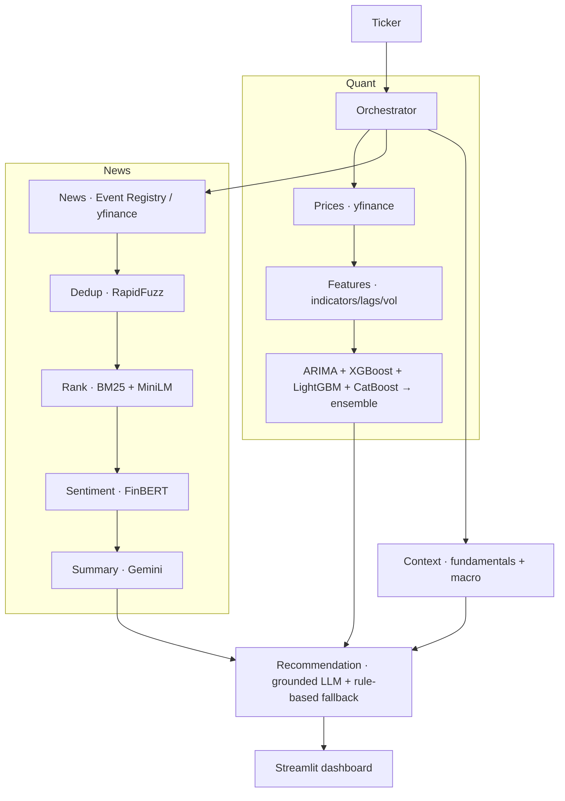

# StockSense AI — Stock Price Prediction using Sentiment Analysis, Agentic AI & Machine Learning

> Final-year Major Project · NIT Hamirpur · Department of Mathematics & Scientific Computing

StockSense AI is a **stock-analysis agent**. Given a ticker it forecasts the next move with real ML
models, reads and scores recent news, and fuses both into a **grounded Buy / Hold / Sell** call with a
plain-English *"why buy / why not"* thesis, confidence, risks, and cited sources — in a Streamlit dashboard.

> ⚠️ **Not financial advice.** This is an educational decision-support tool. Markets are risky.

---

## Problem statement

Investors face information overload and fast-moving markets. Traditional analysis is either purely
numerical (ignoring news/sentiment) or a black box (no explanation). StockSense combines **quantitative
forecasting** + **news sentiment** + **agentic LLM reasoning**, and — crucially — reports its forecast
**honestly** against a naive baseline instead of inflating accuracy.

## What makes it honest (and different)

- Models predict **next-day returns**, not price levels, and are always graded against a naive
  *"tomorrow = today"* baseline plus **directional accuracy**. If a model can't beat the baseline, the UI
  says so. (For most large-cap stocks, daily direction is ~coin-flip — StockSense tells you that instead
  of showing a fake 0.94 R².)
- Every recommendation factor is **grounded** in a computed number or a cited article; a post-check
  strips any fabricated URL. The LLM never invents evidence.
- The app **always** produces a recommendation — if Gemini is unavailable (no key / quota), it falls
  back to a deterministic rule-based reasoner.

---

## What's new in v2

- **US ⇄ India markets** — a region switcher and an **Explore** landing that browses index
  categories (S&P 500 / Nasdaq 100 / Dow 30 · Nifty 50 / Nifty 500 / Sensex / Nifty Bank). NSE tickers
  auto-get the `.NS` suffix.
- **Risk & History** page — annualized volatility, max drawdown, beta, historical VaR, 52-week position,
  and the biggest past single-day moves (your "how it got affected in the past").
- **Screener** — rank a whole index by a fast momentum + trend + low-volatility composite (no LLM),
  then click through to a full analysis. Reports coverage; never silently truncates.
- **Compare** — 2–3 stocks side-by-side (forecast, sentiment, risk) with a rebased price overlay.
- **Report export + Watchlist** — download a Markdown/HTML analyst report; save tickers to a watchlist.
- **Ask (conversational analyst)** — a **LangChain** tool-calling agent that answers free-form questions
  ("How risky is Tesla?", "Compare AAPL and MSFT", "Top Nifty 50 names") by calling the real analysis
  tools, grounded in actual data, with a deterministic **fallback** if the LLM is unavailable.

Pages: **Dashboard · Forecast · Technical · News · Sentiment · Recommendation · Risk · Screener · Compare · Ask · History.**

## Architecture



See **`architecture.md`** for full detail and **`docs/agent_workflow.md`** for the step-by-step agent flow.

## Agent workflow

`Ticker → prices → features → forecast (4 models + ensemble) ∥ news → dedup → rank → FinBERT →
summary ∥ context → fusion → grounded Buy/Hold/Sell → dashboard`. The quant and news pipelines run
concurrently; each stage degrades gracefully (a failure becomes a warning, not a crash).

## Tech stack

| Layer | Choice |
|---|---|
| Prices | `yfinance` (+ disk cache, retries) |
| News | Event Registry API (`requests`) + yfinance `.news` fallback |
| Indicators | `ta` |
| Forecast | `statsmodels` (ARIMA) · `xgboost` · `lightgbm` · `catboost` · `scikit-learn` |
| Embeddings / Sentiment | `sentence-transformers` (MiniLM) · `transformers` (ProsusAI/FinBERT) |
| Retrieval | `rank_bm25` + cosine |
| LLM | Gemini via `google-genai` (`gemini-flash-latest` + fallbacks) |
| Chat agent | `langchain` + `langchain-google-genai` (tool-calling) + rule-based fallback |
| Storage | SQLite (SQLAlchemy) + parquet cache |
| UI | Streamlit + Plotly |

---

## Folder structure

```
stock-sense/
├── config/            settings, logging, news-source credibility
├── data_ingestion/    prices.py, news.py, context.py
├── technical_analysis/ indicators.py, features.py
├── forecasting/       baseline, models, arima_model, ensemble, evaluate, forecaster
├── embeddings/        encoder.py (MiniLM)
├── retrieval/         dedup.py, ranker.py (BM25 + semantic)
├── sentiment/         finbert.py, aggregate.py
├── llm/               client.py, prompts.py, summarizer.py
├── recommendation/    engine.py
├── agents/            base.py, pipeline_agents.py (uniform Agent wrappers)
├── orchestration/     schemas.py (pydantic contracts), pipeline.py (the DAG)
├── database/          cache.py (parquet), db.py + models.py (SQLite)
├── visualization/     charts.py (Plotly) + theme.py (shared template)
├── analytics/         risk.py (v2: risk & history)
├── screener/          score.py, screener.py (v2: leaderboard)
├── compare/           compare.py (v2: side-by-side)
├── report/            export.py (v2: markdown/html report)
├── chat/              tools.py, agent.py (v2: LangChain conversational analyst)
├── config/universe.py + data/universe/*.json  (v2: US/India index constituents)
├── frontend/          app.py + pages/ (Streamlit multipage) + _style.py + .streamlit/config.toml
├── tests/             pytest
├── docs/              agent_workflow · database_schema · api_reference · development_guide
├── architecture.md · plan.md · CLAUDE.md · requirements.txt · .env(.example)
```

---

## Installation

**Requirements:** Python **3.13**, macOS/Linux, ~1 GB free (for cached ML models). CPU-only; no GPU.

```bash
# 1) create a virtual environment on Python 3.13
python3.13 -m venv .venv

# 2) install dependencies (uv is recommended; see the macOS note below)
uv pip install --python .venv/bin/python -r requirements.txt
#   ...or, if pip works on your machine:  .venv/bin/pip install -r requirements.txt

# 3) macOS only: gradient-boosted trees need the OpenMP runtime
brew install libomp

# 4) configure secrets
cp .env.example .env   # then edit .env with your keys

# 5) run
.venv/bin/streamlit run frontend/app.py
```

Open http://localhost:8501, type a ticker (e.g. `AAPL`), click **Run analysis**. The first run downloads
the FinBERT/MiniLM models (~50 s each, cached afterwards).

### ⚠️ macOS 26 (Tahoe) + Homebrew Python gotchas (read if setup fails)
This environment has two known bugs; both are handled/documented:
1. **`pip` crashes** because `platform.mac_ver()` returns `''` on this build (breaks pip's `truststore`).
   → Install with **`uv`** (as above). We also ship `.venv/.../site-packages/_macver_patch.py` +
   `aaa_macver_patch.pth`, which patch `platform.mac_ver()` via `sw_vers` so runtime libs work.
2. **`xgboost`/`lightgbm` fail to load `libomp.dylib`.** → `brew install libomp`.
3. **`pyexpat`/RSS is broken** (libexpat ABI mismatch). We deliberately use JSON news sources only —
   no XML/feedparser — so this doesn't affect the app.
4. **pyarrow mimalloc segfault** — Streamlit converts DataFrames to Arrow in a worker thread, and
   pyarrow's bundled mimalloc crashes there. We force `ARROW_DEFAULT_MEMORY_POOL=system` at interpreter
   startup (venv `.pth`); `./run.sh` also sets it. Recommended launch: **`./run.sh`**.

## Environment variables (`.env`)

| Var | Purpose |
|---|---|
| `NEWS_API_KEY` | **Event Registry** (newsapi.ai) key — NOT newsapi.org. Optional (yfinance news is the fallback). |
| `GEMINI_API_KEY` | Google Gemini key ([aistudio.google.com/apikey](https://aistudio.google.com/apikey)). Optional (rule-based fallback otherwise). |
| `GEMINI_MODEL` | Default `gemini-flash-latest`. |
| `HF_TOKEN` | Optional — faster HuggingFace model downloads. |

**Get keys:** Event Registry → https://eventregistry.org · Gemini → https://aistudio.google.com/apikey

## Database

SQLite is created automatically at `data_cache/stocksense.db` on first run; each analysis is persisted to
a `runs` table (see the **History** page and `docs/database_schema.md`). No setup needed.

---

## Example output (AAPL)

- **Forecast:** ensemble next-day ≈ last close; directional accuracy ~50%; *beats_baseline = False* →
  the app flags the price model as near-random and leans on news/fundamentals.
- **Sentiment:** FinBERT over recent earnings coverage → *positive*.
- **Recommendation:** e.g. **Buy · 62%** — thesis cites Q3 revenue/EPS, analyst target vs. last close,
  and explicitly notes the price model's lack of skill. Sources linked.

## Troubleshooting

| Symptom | Fix |
|---|---|
| `pip` install fails / SSL errors | Use `uv` (see install). |
| `libxgboost.dylib`/`lib_lightgbm.dylib` won't load | `brew install libomp`. |
| "No price data for TICKER" | Bad symbol; use US like `AAPL` or NSE like `TCS.NS`. |
| Recommendation says "rule-based" | No/invalid Gemini key, or free-tier quota (429) — add/rotate a key. |
| First analysis is slow (~30 s) | One-time FinBERT/MiniLM download; subsequent runs are fast. |
| Segfault when opening the Ask page | OpenMP conflict — `langchain-google-genai` must load after `xgboost`. Handled in `chat/agent.py` (imports xgboost first); don't import LangChain before the ML libs. |
| **"Python quit unexpectedly" while clicking around** | pyarrow's bundled **mimalloc** allocator segfaults in `mi_thread_init` when Streamlit converts a DataFrame to Arrow in its script-runner thread. **Fix:** force the system allocator via `ARROW_DEFAULT_MEMORY_POOL=system` — set automatically at startup by the venv `.pth`, or just launch with **`./run.sh`**. |

## Deployment

Local: `streamlit run frontend/app.py`. For a container, base on `python:3.13-slim`, `apt-get install
libgomp1`, `pip install -r requirements.txt`, and set env vars — a Dockerfile is a planned addition
(see `plan.md`, Phase 6). For a hosted demo, Streamlit Community Cloud works (add secrets in its UI).

## Testing

```bash
.venv/bin/python -m pytest tests/ -q
```
Covers no-look-ahead feature construction, metric/skill correctness, dedup, credibility-weighted
sentiment, Event Registry parsing (mocked), grounding, and the rule-based fallback.

## Future improvements

Multi-modal chart reasoning, FRED macro (needs a key), portfolio optimization (Markowitz), model
persistence + Docker, and broader news sources. See `plan.md`.

## Team

Himanshu Kansal (22bee063) · Adarsh Singh (22bma002) · Sahil Jaswal (22bma032) · Manish Kumar (22bma019).
Guide: Dr. Sunil, DOMSC.
