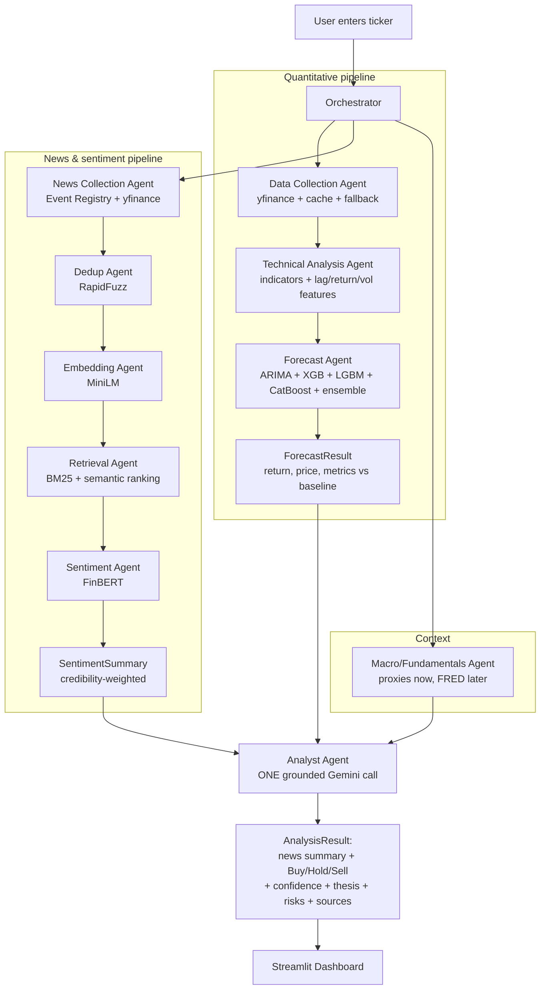

# StockSense AI — Architecture

> **Status:** living document. Update this whenever a module contract, data flow, or
> tech choice changes. See `CLAUDE.md` for the rules that keep this in sync.

---

## 1. What this system is

StockSense AI is a **stock-analysis agent**. Given a ticker, it:

1. **Forecasts** the next move using real ML models trained on price + technical features.
2. **Reads the news + context** (recent articles, sentiment, macro/fundamentals) and summarizes it.
3. **Fuses** both into a grounded **Buy / Hold / Sell** recommendation with a confidence score,
   an explicit *"why buy / why not"* thesis, risks, opportunities, and cited sources.
4. **Presents** everything in a Streamlit dashboard.

It is a decision-support tool, **not financial advice** — every user-facing output carries that disclaimer.

### Core design principles

- **Reuse over rebuild.** Every capability that a maintained library/API already provides is
  *wrapped*, not reimplemented. Custom code is limited to orchestration and the fusion/recommendation logic.
- **Honesty over vanity metrics.** Models predict **next-day return** (not just price level) and are
  always graded against a **naive "tomorrow = today" baseline** plus **directional accuracy**. A model
  that can't beat the baseline is reported as such.
- **Grounding over hallucination.** Every factor in a recommendation cites either a **computed number**
  or a **news URL**. The LLM is never allowed to invent evidence.
- **Modules with clear contracts.** Each step has typed inputs/outputs (see `orchestration/schemas.py`),
  isolated logging, and graceful error handling, so it can be tested and swapped independently.

---

## 2. "Agents" vs modules — an important clarification

The project brief lists ten "agents." Architecturally, **most are deterministic pipeline modules**, not
autonomous LLM agents. Only three steps involve genuine LLM reasoning. We keep the "agent" naming (each
capability is exposed as an `Agent` with a uniform `run()` interface + logging + error handling in
`agents/`), but the real work is done by the underlying libraries.

| # | Agent (brief) | Genuine LLM? | Backed by (pre-existing tool) |
|---|---------------|--------------|-------------------------------|
| 1 | Data Collection | No | `yfinance` (disk cache + retries + stale-cache fallback) |
| 2 | Technical Analysis | No | `ta` (pandas-ta breaks on NumPy 2.x) |
| 3 | Forecast | No | `statsmodels` (ARIMA), `xgboost`, `lightgbm`, `catboost`, `scikit-learn` |
| 4 | News Collection | No | Event Registry API (`requests`) + yfinance `.news` fallback |
| 5 | Duplicate Detection | No | `rapidfuzz` |
| 6 | Embedding | No | `sentence-transformers` (`all-MiniLM-L6-v2`) |
| 7 | Retrieval / Ranking | No | `rank_bm25` + cosine similarity (semantic) |
| 8 | Sentiment | No | `transformers` + `ProsusAI/finbert` |
| 9 | Summarization | **Yes** | Gemini via `LLMClient` — merged into the Analyst call (v3) |
| 10 | Recommendation | **Yes** | Gemini via `LLMClient` + custom fusion logic |

**Custom code we own:** the orchestration DAG, the forecast ensemble/evaluation, the news relevance
ranker, the sentiment aggregation, and the recommendation fusion + grounding.

---

## 3. High-level data flow



---

## 4. Module contracts

All shared data structures live in `orchestration/schemas.py` (pydantic models). Contracts:

| Module (dir) | Entry point | Input → Output |
|---|---|---|
| `data_ingestion/prices.py` | `fetch_prices(ticker, period, interval)` | ticker → OHLCV `DataFrame` (cached) |
| `data_ingestion/news.py` | `fetch_news(ticker, company, days)` | ticker/company → `list[Article]` |
| `data_ingestion/context.py` | `fetch_context(ticker)` | ticker → `MarketContext` (macro proxies, fundamentals) |
| `technical_analysis/features.py` | `build_features(prices, sentiment=None)` | OHLCV → feature `DataFrame` (indicators, lags, returns, vol; sentiment only above the coverage gate) |
| `forecasting/forecaster.py` | `run_forecast(prices, ticker, use_cache=True)` | prices → `ForecastResult` (per-model + ensemble, metrics, horizons; cached) |
| `retrieval/dedup.py` | `deduplicate(articles)` | `list[Article]` → deduped `list[Article]` |
| `embeddings/encoder.py` | `embed(texts)` | `list[str]` → `ndarray` |
| `retrieval/ranker.py` | `rank(query, articles, k)` | query + articles → top-k `list[Article]` |
| `sentiment/finbert.py` | `score(articles)` | articles → articles + per-article sentiment |
| `sentiment/aggregate.py` | `aggregate(articles)` | scored articles → `SentimentSummary` (weighted score) |
| `llm/summarizer.py` | `summarize(company, ticker, articles)` | top articles → `str` summary |
| `llm/summarizer.py` | `headline_digest(company, articles)` | articles → deterministic no-LLM summary |
| `recommendation/engine.py` | `summarize_and_recommend(company, ticker, forecast, sentiment, context, articles)` | all signals → `(summary, Recommendation)` — **one LLM call returning both** |
| `orchestration/pipeline.py` | `analyze(ticker)` | ticker → `AnalysisResult` |

Key schemas: `Article`, `ForecastResult`, `SentimentSummary`, `NewsResult`, `MarketContext`,
`Recommendation`, `AnalysisResult`, `StrategyBacktest`, `TrackRecord`, `SymbolHit`.

---

## 5. Forecasting design (the honest part)

- **Target:** next-day **log return** `r_t = ln(P_t / P_{t-1})`. Displayed price =
  `P_{t-1} * exp(r_hat)`. Also predict weekly / monthly horizons.
- **Features:** lagged returns, rolling mean/std (5/10/20d), realized volatility, volume features,
  and technical indicators (RSI, EMA, SMA, MACD, Bollinger Bands, ATR) via the `ta` library.
- **Models:** ARIMA (statistical baseline on the return series), XGBoost, LightGBM, CatBoost
  (gradient-boosted trees on the feature matrix), plus a **weighted ensemble** (weights ∝ inverse
  validation RMSE).
- **Validation:** `sklearn.model_selection.TimeSeriesSplit` — **no lookahead**, no shuffling.
- **Metrics:** RMSE, MAE, MAPE, R² on returns; **directional accuracy** (% of days the sign is right);
  and **skill vs. the naive persistence baseline** (`r_hat = 0`, i.e. price unchanged). Reported per
  model and for the ensemble.
- **Guardrail:** if no model beats the baseline on directional accuracy, the UI says so plainly.
- **Prediction intervals** (`forecasting/intervals.py`): split **conformal prediction** on the
  ensemble's holdout residuals fills `HorizonForecast.lower`/`upper`. Distribution-free, so the
  fat tails of daily returns don't invalidate it. Calibration and coverage measurement use
  **disjoint** slices of the holdout; when the holdout is too small to split, coverage is reported
  as unknown rather than measured on its own calibration data. Longer horizons are widened by √t —
  an assumption, and labelled as one.
- **Strategy backtest** (`forecasting/strategy.py`): long when the forecast is positive, else cash,
  over the holdout, after transaction costs, versus buy-and-hold. Answers "would following it have
  made money?", which no statistical metric does. Tests the forecast only — the LLM verdict also
  uses sentiment, which has no history to backtest against.
- **Sentiment as a feature** (`technical_analysis/features.attach_sentiment`): gated on
  `MIN_SENTIMENT_COVERAGE`. The news API serves ~4 weeks of history, so daily readings are
  accumulated into `daily_sentiment` on every run; the feature is withheld until it covers 60% of
  the training window, because a column that is empty for most training rows teaches nothing and
  is out-of-distribution at inference.

---

## 6. News → sentiment → summary pipeline

1. **Collect** — Event Registry (`keyword` = company name, `keywordLoc=title`, `sortBy=rel`,
   `skipDuplicates`, `lang=eng`, `dataType=news`); yfinance `.news` as a no-key fallback.
2. **Normalize** — unify to `Article` (title, body/snippet, url, source, published_at).
3. **Dedup** — drop exact + near-duplicates with `rapidfuzz` (token-set ratio threshold).
4. **Embed** — `all-MiniLM-L6-v2` sentence embeddings.
5. **Rank** — BM25 (lexical) + cosine similarity (semantic) against a relevance query; keep top-k.
6. **Sentiment** — FinBERT per article → {positive, negative, neutral} + probability; aggregate to a
   **source-credibility-weighted** sentiment score.
7. **Summarize** — send only the top-k compressed articles to Gemini (token-efficient) for a crisp,
   reasoned summary.

---

## 7. Recommendation & grounding

The Recommendation Agent fuses: forecast (return + confidence), weighted news sentiment, macro/context,
and recent events. It returns a `Recommendation`:

- `action`: Buy / Hold / Sell
- `confidence`: 0–1 (calibrated from model agreement + sentiment strength + forecast magnitude)
- `thesis`: **why to buy (or not)** — the summary the user asked for
- `positive_factors`, `negative_factors`, `risks`, `opportunities` — each **grounded** in a number or a
  cited article URL
- `disclaimer`: not financial advice (always present)

**Anti-hallucination:** the LLM prompt supplies the exact computed numbers and the retrieved article list,
and is instructed to cite only from those. A post-check verifies every cited URL exists in the input set.

---

## 8. Technology stack

| Layer | Choice | Notes |
|---|---|---|
| Runtime | **Python 3.13** (venv) | 3.14 lacks some ML wheels; 3.13 has full support |
| Prices | `yfinance` only | Stooq fallback is dead; robust via disk cache + retries + stale-cache |
| News | Event Registry (`requests`) + yfinance `.news` | the key is an Event Registry key; RSS dropped (pyexpat broken) |
| Indicators | `ta` | pandas-ta imports `numpy.NaN` (removed in NumPy 2.x) |
| Forecast | `statsmodels`, `xgboost`, `lightgbm`, `catboost`, `scikit-learn` | |
| Embeddings | `sentence-transformers` (`all-MiniLM-L6-v2`) | CPU, ~90 MB |
| Retrieval | `rank_bm25` + numpy cosine | (FAISS optional later) |
| Dedup | `rapidfuzz` | |
| Sentiment | `transformers` + `torch` + `ProsusAI/finbert` | CPU, ~400 MB |
| LLM | Gemini via `google-genai` (`gemini-flash-latest` + fallbacks) | 2.5-flash retired for this key; behind `LLMClient` — swappable |
| Config | `pydantic-settings` + `python-dotenv` | reads `.env` |
| Storage | SQLite (SQLAlchemy) + parquet cache | Postgres is a later swap |
| Frontend | `streamlit` + `plotly` | multipage dashboard |
| Orchestration | plain Python DAG (`concurrent.futures`) | LangChain only if tool-use is added later |

### Deliberate MVP deviations from the brief
- **SQLite/parquet** instead of PostgreSQL (one-file swap later).
- **Direct Gemini SDK** instead of LangChain (the DAG is deterministic; LangChain earns its place only
  if we add tool-using reasoning).
- Both are documented here and isolated behind interfaces so the swap is trivial.

---

## 8b. v2 additions (additive — v1 contracts unchanged)

- **Markets/universe:** `data_ingestion/markets.py` (region inference, `.NS` normalization, benchmark)
  + `config/universe.py` + `data/universe/*.json` (US/India index constituents). Region switcher + Explore
  landing in the frontend.
- **Risk & History:** `analytics/risk.py` → `RiskProfile` (vol, drawdown, beta, VaR, biggest moves). Added
  as an optional `RiskAgent` stage; `AnalysisResult.risk` is optional (v1 ignores it).
- **Screener:** `screener/` — LLM-free composite score, concurrency-capped, coverage-reported.
- **Compare:** `compare/` — concurrent multi-ticker analysis + rebased overlay.
- **Report/Watchlist:** `report/export.py` (Markdown/HTML) + a new additive `watchlist` SQLite table.
- **Conversational analyst:** `chat/` — a LangChain tool-calling agent wrapping the existing capabilities,
  with a deterministic fallback. **Gotcha:** it imports xgboost before `langchain-google-genai` to avoid a
  macOS OpenMP segfault.
- **Theme:** `visualization/theme.py` (shared Plotly template) + `.streamlit/config.toml` + `frontend/_style.py`.

## 8d. v3 frontend structure

The numbered `frontend/pages/` convention was replaced by **`st.navigation`**:

- `frontend/app.py` is a **router**. It owns `st.set_page_config`, the stylesheet, the model
  warm-up and the sidebar, then declares the grouped nav (Analysis / News / Decision / Discover /
  More) with Material icons and calls `page.run()`.
- `frontend/views/*.py` render content only and must **not** call `st.set_page_config` — they
  execute inside the router's script run.
- `_shared.boot()` runs once per rerun from `app.py`; `_shared.sidebar()` renders the brand,
  market switcher, search box and watchlist.

**Errors are split by audience.** `agents/base.StageError` is a `str` subclass carrying `.detail`;
`Agent.safe_run` returns a plain-English sentence from a per-stage map while keeping the exception
text on `.detail`. `orchestration/pipeline._Problems` routes the two into
`AnalysisResult.errors`/`warnings` (shown) and `AnalysisResult.details` (a collapsed expander).

**Symbol search.** `data_ingestion/markets.search_symbols(query, region, limit)` wraps Yahoo's
symbol search so users can type a company name instead of a ticker. It returns `SymbolHit`s ranked
with the selected market first, caches for 24 h, and returns `[]` on failure. Results are already
exchange-qualified, so callers must **not** re-normalize them.

**Testing note:** views are not standalone scripts under `st.navigation`. Drive `app.py` and route
with `AppTest.switch_page("views/<name>.py")` — `query_params` is ignored, and using it makes every
check silently render the default page instead.

### Threading constraints (do not "optimize" these away)

This process loads **three copies of `libomp.dylib`** and runs GBM training concurrently with
PyTorch inference. Two settings keep that survivable, and both are stability requirements rather
than tuning choices:

- **`forecasting/models.py: _THREADS = 1`** — `n_jobs=-1` makes each GBM fork its own OpenMP
  worker pool; those pools hit a barrier owned by a different OpenMP runtime and segfault the
  process (`__kmp_fork_barrier`). It is also *faster* here, since the training set is tiny.
  Note `OMP_NUM_THREADS` alone does **not** help: `n_jobs` overrides it.
- **`device="cpu"` on FinBERT and MiniLM** — otherwise Apple Silicon selects the MPS (GPU)
  backend, which is not safe to call from multiple threads.

Both model loaders are lock-guarded: `lru_cache` alone lets the warm-up thread and a live request
build two copies of the model at once.

Reproducing threading crashes requires driving the app through `AppTest`, not calling `analyze()`
directly — the script-runner thread is part of the trigger.

All new pages read the shared `AnalysisResult` via `frontend/_shared.py`; no v1 signature changed.

## 8c. v3 performance notes (no signatures changed)

Profiling (`scripts/profile_run.py`) showed the LLM — not model training — dominates a run: the 21
GBM fits + 3 ARIMA fits total ~4.5 s, while Gemini accounted for 85–95 % of wall clock. Two changes
followed, both behind the existing interfaces:

- **Quota-aware model fallback** (`llm/client.py`). A `429` is now split into two cases. A short
  per-minute rate limit is still retried with backoff; a per-**day** free-tier quota (detected from
  the API's own `RetryInfo.retryDelay`, or per-day wording) cannot clear inside our 5.1 s backoff
  budget, so the model is **parked in a cooldown map and skipped** on later calls instead of being
  retried four times per call. When every model is parked, `_run` raises `LLMUnavailable`
  immediately so callers fall through to their deterministic path without waiting.
- **LLM response caching** (`llm/summarizer.py`, `recommendation/engine.py`). Both cache through
  `database/cache.py` with a 24 h TTL. Keys are built from **the inputs the LLM sees** — the article
  set, and for the recommendation also the rounded forecast and sentiment figures — so a cached
  answer is reused only while those are unchanged, and never survives a change in the underlying
  numbers. Only successful LLM responses are cached; the rule-based fallback never is, so a
  degraded answer cannot get pinned.

- **One merged LLM call** (`recommendation/engine.py::summarize_and_recommend`, driven by
  `AnalystAgent`). Summarization and recommendation were two separate Gemini calls; they are now
  one, via `llm/prompts.py::combined_prompt` and the `CombinedDraft` schema. Two reasons:

  1. **Cost.** Free tier is 20 requests/day *per model*. Halving calls doubles daily capacity.
  2. **Consistency.** `summary_prompt` never received the FinBERT score, so the summary could
     contradict the Sentiment page — measured: it called AAPL "Cautious/Mixed" against −0.065 and
     MSFT "Mixed" against −0.390. The merged prompt carries both, and agreed with the score.

  `CombinedDraft` declares `news_summary` **before** the verdict fields so the model writes the
  summary first and reasons from it. `_evidence_block()` is shared by both prompts so they cannot
  drift apart. Fallbacks are unchanged: no LLM → `headline_digest()` (now shared with
  `summarize()`) plus the rule-based recommendation.

  The old split path — `recommend()`, `RecommendationAgent` and `recommendation_prompt` — was
  **deleted** rather than left in place, and `tests/test_pipeline_units.py` now exercises
  `summarize_and_recommend(..., use_llm=False)` so the rule-based fallback is tested on the path
  that actually runs. `SummarizationAgent` / `summary_prompt` remain in use: when the forecast
  fails there is no recommendation to make, but the news is still worth summarizing.

- **Forecast caching** (`forecasting/forecaster.py`). `run_forecast(prices, ticker, use_cache=True)`
  stores its `ForecastResult` keyed on ticker + the **date of the last price bar** + a hash of the
  training settings. Keying on the bar date rather than wall-clock time means a new trading day
  invalidates the entry by itself, so a stale forecast can never be served as today's; the settings
  hash means changing `min_history_rows` (or bumping `_CACHE_VERSION` when the model roster changes)
  busts it automatically.

- **Model warm-up** (`frontend/_warmup.py`, started from `_shared.setup()`). FinBERT and MiniLM load
  in a daemon thread at app start instead of inside the first analysis. The guard is module-level,
  not session state — the `lru_cache`d models belong to the process, not to a visitor.

- **Screener fetch window** (`screener/score.py`). `quick_score` fetches 1 year rather than the full
  `price_period`; it only needs a 3-month return and a 50-day SMA. It caches under its own key, so
  the shorter series can never be mistaken for the training data.

Grounding is unaffected: a cached `Recommendation` was already passed through `_ground()` when it
was produced, and the merged draft is finalized through exactly the same `_finalize()`/`_ground()`.

## 9. Repository layout

```
stock-sense/
├── config/              # settings.py (env), logging_config.py, sources.py (RSS list, credibility weights)
├── data_ingestion/      # prices.py, news.py, context.py
├── technical_analysis/  # indicators.py, features.py
├── forecasting/         # baseline.py, arima_model.py, models.py, ensemble.py, evaluate.py, forecaster.py
├── embeddings/          # encoder.py
├── retrieval/           # dedup.py, ranker.py (BM25 + semantic fused)
├── sentiment/           # finbert.py, aggregate.py
├── llm/                 # client.py (LLMClient/Gemini), prompts.py, summarizer.py
├── recommendation/      # engine.py
├── agents/              # base.py + one thin Agent wrapper per capability (uniform run/log/errors)
├── orchestration/       # schemas.py (pydantic), pipeline.py (the DAG)
├── database/            # db.py, models.py, cache.py
├── visualization/       # charts.py (plotly)
├── frontend/            # app.py (st.navigation router) + views/ + _shared/_style/_warmup
├── utils/               # logging helpers, timing, retries
├── models_store/        # persisted trained models (gitignored)
├── data_cache/          # parquet price/news cache (gitignored)
├── tests/               # pytest
├── docs/                # agent_workflow.md, database_schema.md, api_reference.md, development_guide.md
├── plan.md              # phased roadmap
├── architecture.md      # this file
├── CLAUDE.md            # repo rules for AI-assisted work
├── requirements.txt
├── .env / .env.example  # secrets (.env gitignored)
└── README.md
```
