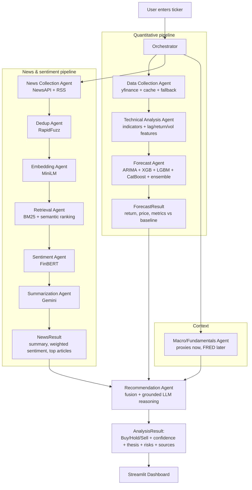

# StockSense AI — Architecture

> **Status:** living document. Update this whenever a module contract, data flow, or
> tech choice changes. See `CLAUDE.md` for the rules that keep this in sync.

---

## 1. What this system is

StockSense AI is a **stock-analysis agent**. Given a ticker, it:

1. **Forecasts** the next move using real ML models trained on price + technical features.
2. **Reads the news + context** (recent articles, sentiment, macro/fundamentals) and summarizes it.
3. **Fuses** both into a grounded **Buy / Hold / Sell** recommendation with a confidence score,
   an explicit *"why buy / why not"* thesis, risks, opportunities, and cited sources.
4. **Presents** everything in a Streamlit dashboard.

It is a decision-support tool, **not financial advice** — every user-facing output carries that disclaimer.

### Core design principles

- **Reuse over rebuild.** Every capability that a maintained library/API already provides is
  *wrapped*, not reimplemented. Custom code is limited to orchestration and the fusion/recommendation logic.
- **Honesty over vanity metrics.** Models predict **next-day return** (not just price level) and are
  always graded against a **naive "tomorrow = today" baseline** plus **directional accuracy**. A model
  that can't beat the baseline is reported as such.
- **Grounding over hallucination.** Every factor in a recommendation cites either a **computed number**
  or a **news URL**. The LLM is never allowed to invent evidence.
- **Modules with clear contracts.** Each step has typed inputs/outputs (see `orchestration/schemas.py`),
  isolated logging, and graceful error handling, so it can be tested and swapped independently.

---

## 2. "Agents" vs modules — an important clarification

The project brief lists ten "agents." Architecturally, **most are deterministic pipeline modules**, not
autonomous LLM agents. Only three steps involve genuine LLM reasoning. We keep the "agent" naming (each
capability is exposed as an `Agent` with a uniform `run()` interface + logging + error handling in
`agents/`), but the real work is done by the underlying libraries.

| # | Agent (brief) | Genuine LLM? | Backed by (pre-existing tool) |
|---|---------------|--------------|-------------------------------|
| 1 | Data Collection | No | `yfinance` (+ Stooq fallback, disk cache) |
| 2 | Technical Analysis | No | `ta` (pandas-ta breaks on NumPy 2.x) |
| 3 | Forecast | No | `statsmodels` (ARIMA), `xgboost`, `lightgbm`, `catboost`, `scikit-learn` |
| 4 | News Collection | No | Event Registry API (`requests`) + yfinance `.news` fallback |
| 5 | Duplicate Detection | No | `rapidfuzz` |
| 6 | Embedding | No | `sentence-transformers` (`all-MiniLM-L6-v2`) |
| 7 | Retrieval / Ranking | No | `rank_bm25` + cosine similarity (semantic) |
| 8 | Sentiment | No | `transformers` + `ProsusAI/finbert` |
| 9 | Summarization | **Yes** | Gemini 2.5 Flash (via `LLMClient`) |
| 10 | Recommendation | **Yes** | Gemini 2.5 Flash (via `LLMClient`) + custom fusion logic |

**Custom code we own:** the orchestration DAG, the forecast ensemble/evaluation, the news relevance
ranker, the sentiment aggregation, and the recommendation fusion + grounding.

---

## 3. High-level data flow



---

## 4. Module contracts

All shared data structures live in `orchestration/schemas.py` (pydantic models). Contracts:

| Module (dir) | Entry point | Input → Output |
|---|---|---|
| `data_ingestion/prices.py` | `fetch_prices(ticker, period, interval)` | ticker → OHLCV `DataFrame` (cached) |
| `data_ingestion/news.py` | `fetch_news(ticker, company, days)` | ticker/company → `list[Article]` |
| `data_ingestion/context.py` | `fetch_context(ticker)` | ticker → `MarketContext` (macro proxies, fundamentals) |
| `technical_analysis/features.py` | `build_features(prices)` | OHLCV → feature `DataFrame` (indicators, lags, returns, vol) |
| `forecasting/forecaster.py` | `run_forecast(features)` | features → `ForecastResult` (per-model + ensemble, metrics, horizons) |
| `retrieval/dedup.py` | `deduplicate(articles)` | `list[Article]` → deduped `list[Article]` |
| `embeddings/encoder.py` | `embed(texts)` | `list[str]` → `ndarray` |
| `retrieval/ranker.py` | `rank(query, articles, k)` | query + articles → top-k `list[Article]` |
| `sentiment/finbert.py` | `score(articles)` | articles → articles + per-article sentiment |
| `sentiment/aggregate.py` | `aggregate(articles)` | scored articles → `SentimentSummary` (weighted score) |
| `llm/summarizer.py` | `summarize(articles, ticker)` | top articles → `str` summary |
| `recommendation/engine.py` | `recommend(forecast, news, context)` | all signals → `Recommendation` |
| `orchestration/pipeline.py` | `analyze(ticker)` | ticker → `AnalysisResult` |

Key schemas: `Article`, `ForecastResult`, `SentimentSummary`, `NewsResult`, `MarketContext`,
`Recommendation`, `AnalysisResult`.

---

## 5. Forecasting design (the honest part)

- **Target:** next-day **log return** `r_t = ln(P_t / P_{t-1})`. Displayed price =
  `P_{t-1} * exp(r_hat)`. Also predict weekly / monthly horizons.
- **Features:** lagged returns, rolling mean/std (5/10/20d), realized volatility, volume features,
  and technical indicators (RSI, EMA, SMA, MACD, Bollinger Bands, ATR) via `pandas-ta`.
- **Models:** ARIMA (statistical baseline on the return series), XGBoost, LightGBM, CatBoost
  (gradient-boosted trees on the feature matrix), plus a **weighted ensemble** (weights ∝ inverse
  validation RMSE).
- **Validation:** `sklearn.model_selection.TimeSeriesSplit` — **no lookahead**, no shuffling.
- **Metrics:** RMSE, MAE, MAPE, R² on returns; **directional accuracy** (% of days the sign is right);
  and **skill vs. the naive persistence baseline** (`r_hat = 0`, i.e. price unchanged). Reported per
  model and for the ensemble.
- **Guardrail:** if no model beats the baseline on directional accuracy, the UI says so plainly.

---

## 6. News → sentiment → summary pipeline

1. **Collect** — Event Registry (`keyword` = company name, `keywordLoc=title`, `sortBy=rel`,
   `skipDuplicates`, `lang=eng`, `dataType=news`); yfinance `.news` as a no-key fallback.
2. **Normalize** — unify to `Article` (title, body/snippet, url, source, published_at).
3. **Dedup** — drop exact + near-duplicates with `rapidfuzz` (token-set ratio threshold).
4. **Embed** — `all-MiniLM-L6-v2` sentence embeddings.
5. **Rank** — BM25 (lexical) + cosine similarity (semantic) against a relevance query; keep top-k.
6. **Sentiment** — FinBERT per article → {positive, negative, neutral} + probability; aggregate to a
   **source-credibility-weighted** sentiment score.
7. **Summarize** — send only the top-k compressed articles to Gemini (token-efficient) for a crisp,
   reasoned summary.

---

## 7. Recommendation & grounding

The Recommendation Agent fuses: forecast (return + confidence), weighted news sentiment, macro/context,
and recent events. It returns a `Recommendation`:

- `action`: Buy / Hold / Sell
- `confidence`: 0–1 (calibrated from model agreement + sentiment strength + forecast magnitude)
- `thesis`: **why to buy (or not)** — the summary the user asked for
- `positive_factors`, `negative_factors`, `risks`, `opportunities` — each **grounded** in a number or a
  cited article URL
- `disclaimer`: not financial advice (always present)

**Anti-hallucination:** the LLM prompt supplies the exact computed numbers and the retrieved article list,
and is instructed to cite only from those. A post-check verifies every cited URL exists in the input set.

---

## 8. Technology stack

| Layer | Choice | Notes |
|---|---|---|
| Runtime | **Python 3.13** (venv) | 3.14 lacks some ML wheels; 3.13 has full support |
| Prices | `yfinance` only | Stooq fallback is dead; robust via disk cache + retries + stale-cache |
| News | Event Registry (`requests`) + yfinance `.news` | the key is an Event Registry key; RSS dropped (pyexpat broken) |
| Indicators | `ta` | pandas-ta imports `numpy.NaN` (removed in NumPy 2.x) |
| Forecast | `statsmodels`, `xgboost`, `lightgbm`, `catboost`, `scikit-learn` | |
| Embeddings | `sentence-transformers` (`all-MiniLM-L6-v2`) | CPU, ~90 MB |
| Retrieval | `rank_bm25` + numpy cosine | (FAISS optional later) |
| Dedup | `rapidfuzz` | |
| Sentiment | `transformers` + `torch` + `ProsusAI/finbert` | CPU, ~400 MB |
| LLM | Gemini via `google-genai` (`gemini-flash-latest` + fallbacks) | 2.5-flash retired for this key; behind `LLMClient` — swappable |
| Config | `pydantic-settings` + `python-dotenv` | reads `.env` |
| Storage | SQLite (SQLAlchemy) + parquet cache | Postgres is a later swap |
| Frontend | `streamlit` + `plotly` | multipage dashboard |
| Orchestration | plain Python DAG (`concurrent.futures`) | LangChain only if tool-use is added later |

### Deliberate MVP deviations from the brief
- **SQLite/parquet** instead of PostgreSQL (one-file swap later).
- **Direct Gemini SDK** instead of LangChain (the DAG is deterministic; LangChain earns its place only
  if we add tool-using reasoning).
- Both are documented here and isolated behind interfaces so the swap is trivial.

---

## 8b. v2 additions (additive — v1 contracts unchanged)

- **Markets/universe:** `data_ingestion/markets.py` (region inference, `.NS` normalization, benchmark)
  + `config/universe.py` + `data/universe/*.json` (US/India index constituents). Region switcher + Explore
  landing in the frontend.
- **Risk & History:** `analytics/risk.py` → `RiskProfile` (vol, drawdown, beta, VaR, biggest moves). Added
  as an optional `RiskAgent` stage; `AnalysisResult.risk` is optional (v1 ignores it).
- **Screener:** `screener/` — LLM-free composite score, concurrency-capped, coverage-reported.
- **Compare:** `compare/` — concurrent multi-ticker analysis + rebased overlay.
- **Report/Watchlist:** `report/export.py` (Markdown/HTML) + a new additive `watchlist` SQLite table.
- **Conversational analyst:** `chat/` — a LangChain tool-calling agent wrapping the existing capabilities,
  with a deterministic fallback. **Gotcha:** it imports xgboost before `langchain-google-genai` to avoid a
  macOS OpenMP segfault.
- **Theme:** `visualization/theme.py` (shared Plotly template) + `.streamlit/config.toml` + `frontend/_style.py`.

All new pages read the shared `AnalysisResult` via `frontend/_shared.py`; no v1 signature changed.

## 9. Repository layout

```
stock-sense/
├── config/              # settings.py (env), logging_config.py, sources.py (RSS list, credibility weights)
├── data_ingestion/      # prices.py, news.py, context.py
├── technical_analysis/  # indicators.py, features.py
├── forecasting/         # baseline.py, arima_model.py, gbm_models.py, ensemble.py, evaluate.py, forecaster.py
├── embeddings/          # encoder.py
├── retrieval/           # dedup.py, bm25.py, semantic.py, ranker.py
├── sentiment/           # finbert.py, aggregate.py
├── llm/                 # client.py (LLMClient/Gemini), prompts.py, summarizer.py
├── recommendation/      # engine.py
├── agents/              # base.py + one thin Agent wrapper per capability (uniform run/log/errors)
├── orchestration/       # schemas.py (pydantic), pipeline.py (the DAG)
├── database/            # db.py, models.py, cache.py
├── visualization/       # charts.py (plotly)
├── frontend/            # app.py + pages/ (Streamlit multipage)
├── utils/               # logging helpers, timing, retries
├── models_store/        # persisted trained models (gitignored)
├── data_cache/          # parquet price/news cache (gitignored)
├── tests/               # pytest
├── docs/                # agent_workflow.md, database_schema.md, api_reference.md, development_guide.md
├── plan.md              # phased roadmap
├── architecture.md      # this file
├── CLAUDE.md            # repo rules for AI-assisted work
├── requirements.txt
├── .env / .env.example  # secrets (.env gitignored)
└── README.md
```
