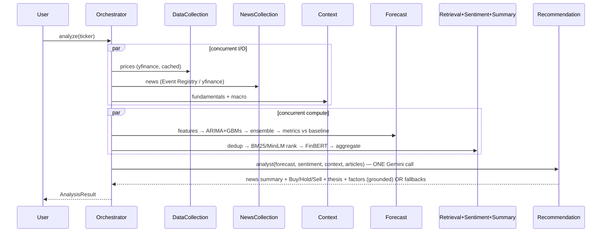

# Agent Workflow

Each capability is exposed as an `Agent` (uniform `run()` + logging + `safe_run` graceful
degradation, `agents/base.py`) wrapping a domain module. The orchestrator (`orchestration/pipeline.py`)
chains them into a DAG.

## Agents (input → output)

| Agent | Module | Input → Output |
|---|---|---|
| DataCollection | `data_ingestion/prices.py` | ticker → OHLCV DataFrame |
| Forecast | `forecasting/forecaster.py` | prices → `ForecastResult` |
| NewsCollection | `data_ingestion/news.py` | ticker, company → `list[Article]` |
| Dedup | `retrieval/dedup.py` | articles → deduped articles |
| Retrieval | `retrieval/ranker.py` | query, articles, k → top-k ranked |
| Sentiment | `sentiment/{finbert,aggregate}.py` | articles → scored articles + `SentimentSummary` |
| Context | `data_ingestion/context.py` | ticker → `MarketContext` |
| **Analyst** | `recommendation/engine.py::summarize_and_recommend` | all signals → **(summary, `Recommendation`)** in one Gemini call |
| Summarization | `llm/summarizer.py` | articles → summary text — used only when there is no forecast |

**Why one call.** Summarization and recommendation used to be two Gemini requests. Free tier allows
20 requests/day *per model*, so merging doubles daily capacity. It also fixed a real inconsistency:
`summary_prompt` never saw the FinBERT score, so the summary could contradict the Sentiment page
(measured: "Mixed" against a −0.390 score). The merged prompt carries both and agrees with it.

## Conversational analyst (v2)

The **Ask** page uses a LangChain/LangGraph tool-calling agent (`chat/agent.py`) over Gemini, with
conversation memory and a grounding + anti-injection system prompt. Its tools (`chat/tools.py`) wrap the
existing capabilities and each returns compact grounded text:

| Tool | Wraps |
|---|---|
| `analyze_stock(ticker)` | `orchestration.pipeline.analyze` |
| `risk_history(ticker)` | `analytics.risk.compute_risk` |
| `screen_index(region, index_key)` | `screener.screener.screen` |
| `compare_stocks(tickers_csv)` | `compare.compare.compare` |
| `resolve_ticker(query, region)` | ticker normalization + validation |

If the LLM is unavailable (no key / quota / error), a deterministic **intent parser** routes the prompt to
the same tools — chat never hard-fails. Note: `chat/agent.py` imports xgboost before LangChain to avoid a
macOS OpenMP segfault.

## Degradation rules
- Prices missing → early return with a clear error (prices are essential).
- News / context / forecast / summary / sentiment failures → recorded as warnings; the rest proceeds.
- LLM unavailable (no key / quota / retired model) → deterministic rule-based recommendation.
